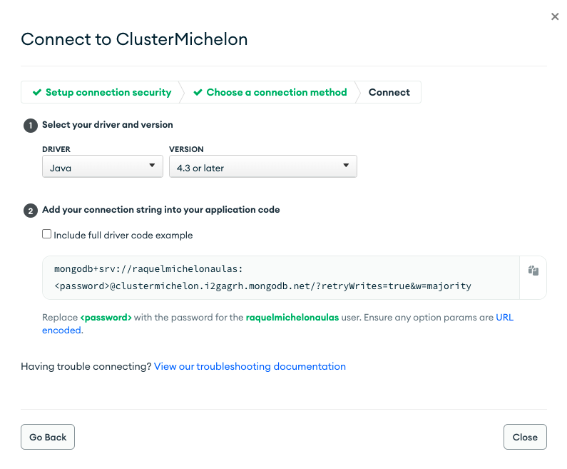

<p align="center">
    <br>
    
    <br>
    <br>
    <h1>
    <b>Best Places to Visit on the Vacations</b>
    </h1>
</p>

Api Rest with Srping Boot Framework, Java Programming Language and MongoDB database.

### Spring Initializer Model


### DB Configs - [MongoDB Atlas](https://www.mongodb.com/): db on cloud

- 1. Configure the personal account
- 2. Click on "Project0"


- 3. Go to "Browser Collections"


- 4. Go to "Add My Own Data"

 

- 5. Give a name for the database and the collection and click on "Create"


- 6. Click on "Insert Document" 


- 7. Complete the Json field with the data (in that case, each destiny in your own document)


- 8. Go to Overview -> Connect -> Connect your Application -> Copy the Config String and paste on the `application.properties` of the project filling the password and the db name.




```
spring.data.mongodb.uri=mongodb+srv://raquelmichelonaulas:<password>@clustermichelon.i2gagrh.mongodb.net/<NAMEDB>?retryWrites=true&w=majority

```


### Tests on Insomnia

GET ALL 


CREATE ONE (POST method)


### Created the new document on the Database


### Deploy on Heroku

- Open a new terminal inside the project folder

- Run the following command in order to get the maven if you haven't it, 
download the jars in the dependency list, compile the program, compile and run tests, 
generate the jar with all application to delivery it. The jar will be generated on the `target` folder


``` 
./mvnw package 

``` 

- The absolute path to my file in my computer is `/Users/raqueldarellimichelon/Documentos/IFSC/IoTProject/vacations-destiny-mongo-api/target/vacations-destiny-mongo-api-0.0.1-SNAPSHOT.jar`

- To run the application go to the folder where the new jar file is and run

``` java -jar vacations-destiny-mongo-api-0.0.1-SNAPSHOT.jar ```

- Create a new application on Heroku: New -> Create New App

Put a name and click on Create app

- Follow this steps suggests for the Heroku team


- If some error occurs, maybe the problem is with the Java version that heroku setted to the application. To solve that, 
we just include on the root folder of the project the file `system.properties` with the following content:

```
java.runtime.version=17
```


### New Tests on Insomnia pointing to heroku app

GET ALL 


CREATE ONE (POST method)


### Created the new document on the Database


